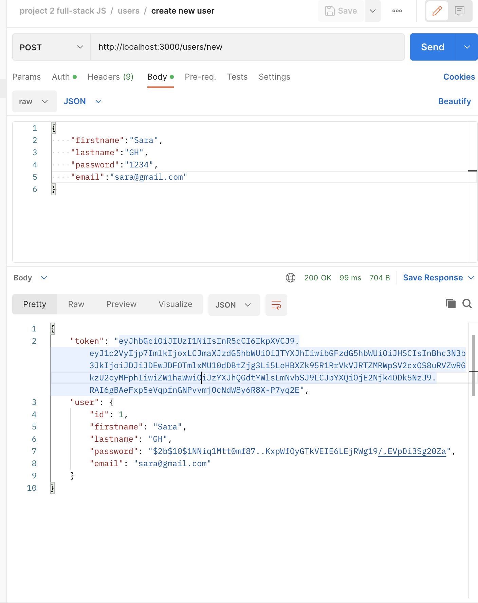
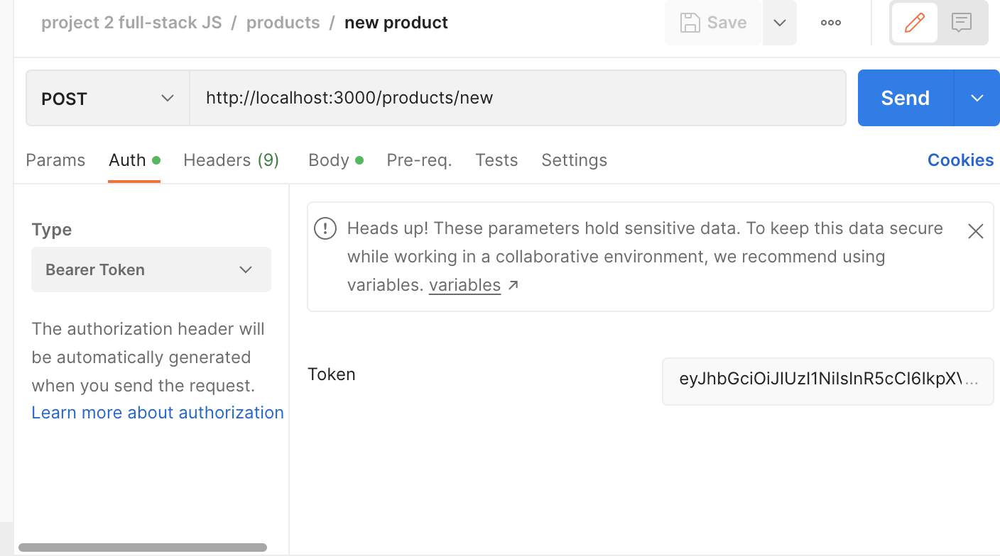
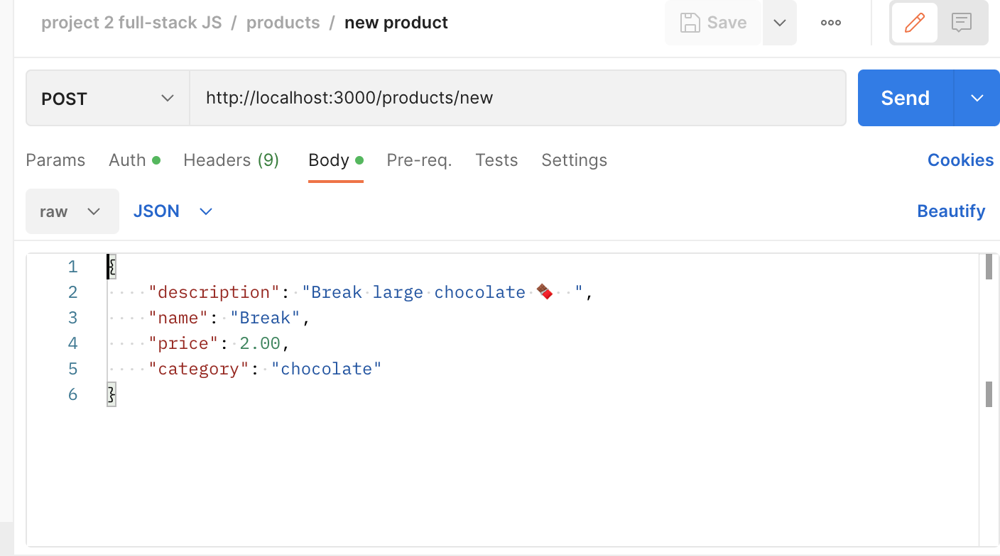

# Creating-API-with-postgres

# Storefront Backend Project

## Getting Started
THE DATABASE IS RUNNING ON PORT 5432
THIS APPLICATION RUN ON PORT 3000

1. run the following command to install all dependencies:
    ```npm i```

2. create 2 databases:
    ```
    CREATE DATABASE db_name_dev;
    CREATE DATABASE db_name_test;

    GRANT ALL PRIVILEGES ON DATABASE db_name_dev TO username;
    GRANT ALL PRIVILEGES ON DATABASE db_name_test TO username;
    ```

3. create .env file and write inside it the following and change(db_name_dev , db_name_tes , username , password);

    ```
    HOST=127.0.0.1
    DB=db_name_dev
    DB_TEST=db_name_tes
    USER=username
    PASSWORD=password
    PORT=3000
    ENV=test
    BCRYPT_PASSWORD= your-secret-password 
    SALT_ROUND=10
    TOKEN_SECRET=token1234
    ADDRESS=0.0.0.0:3000
    ```

3. run migrations:
    to run migration in dev mode:
    ```ENV=dev db-migrate up```

    to run migration in test mode (default mode):
    ```db-migrate up```

4. to run tests:
    ```run npm test```

5. to run in dev mode:
    ```ENV=dev npm run watch```

## Tables in databaase:
there are 4 tables:

### users
    id
    firstname
    lastname
    password
    email (should be unique)

### orders
    id
    status
    user_id

### products
    id
    description
    name
    price
    category
    user_id

### orders_products
    id
    quantity
    order_id
    product_id


## Routes:

### users Route:
started with (/users).
- Index [authentication required] 
    ' /users ' [GET]

- Show [authentication required] 
    ' /users/:id ' [GET]

- Create new user 
    ' /users/new ' [POST]



### orders Route:
- Current Order by user (args: user id)[authentication required]  
    ' /orders/:userId/current-order ' [GET]


- [OPTIONAL] Completed Orders by user (args: user id)[authorization required] 
    ' /orders/:userId/compeleted ' [GET]

### products Route:
started with (/products).
- Index 
    ' /products ' [GET]

- Show  
    ' /products/:id ' [GET]

- Create [authentication required] 
    ( /products/new ) [POST]








- [OPTIONAL] Products by category (args: product category) 
    ' /products/category/:category ' [GET]

### orders-products Route:
started with (/orders-products).
- [OPTIONAL] Top 5 most popular products 
    ' /orders-products/topProducts/:number ' [GET]
