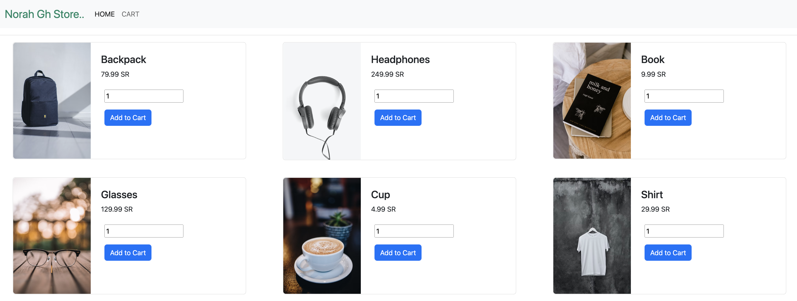
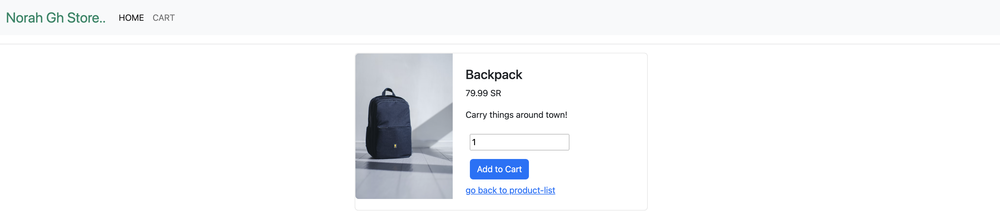
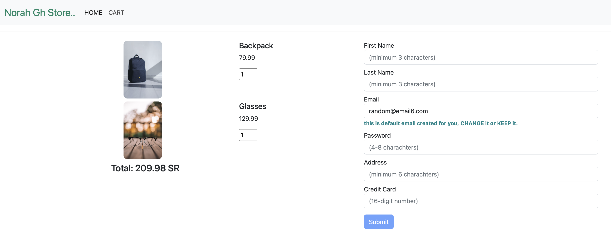
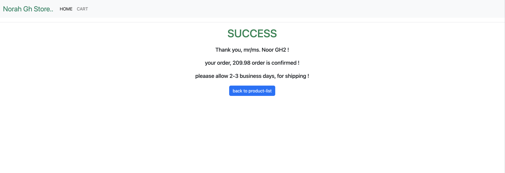
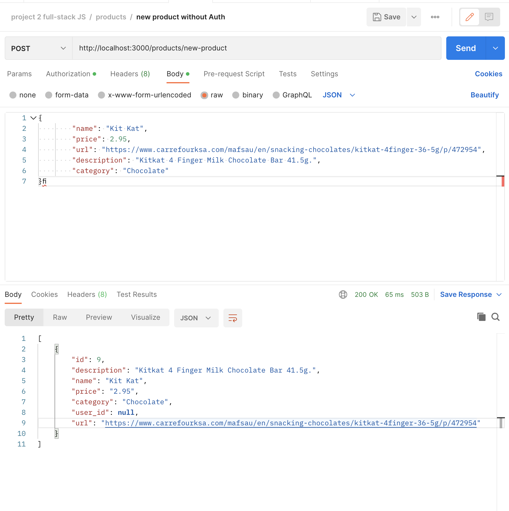

# Storefront & Backend Project

## Description

This is online store to sell products.

#### - The Home Page [http://localhost:4200/]:

Shows a list of products to sell, user can click button (add to cart) to add the chosen product to cart.


#### - The Details Page [http://localhost:4200/product/:id]:

Show the product details and an option to add product to cart.



#### - The Cart Page [http://localhost:4200/cart]:

Shows the products the user have choosen, user can (increase , decrese the quantity of products to order OR delete) and the total is calculated immediately , and can procceed to checkout by filling th form on the right side and clicking (submit).




#### - The Checkout Page [http://localhost:4200/checkout]:

Print the order details (username , total , status), and show the estemated delivery.




## Basic Functions:
#### - display products:
in the home-page where all available products are listed [ http://localhost:4200/ ]

#### - add product to cart:
user can add product to cart through:
- home-page [ http://localhost:4200/ ]
- details-page [ http://localhost:4200/product/:id ]

#### - View Order:
user can view the order with the selected items in cart-page:
- cart-page [http://localhost:4200/cart ]

#### - Place order & proceed to checkout:
user can place an order with the selected items, by filling the form and clicking submit:
- cart-page [http://localhost:4200/cart ]


```
THE DATABASE IS RUNNING ON PORT 5432
THE BACK-END APPLICATION RUN ON PORT 3000
THE FRONT-END APPLICATION RUN ON PORT 4200
```

## Getting Started
First, cd to (store-backend):
- install dependencies.
- setup .env file
- create the realted databases.
- run migrations.
- create the products needed to be shown in the store.
    
Then cd to (store-frontend):
- install dependencies.
- run (ng serve)

## store-backend


1. run the following command to install all dependencies:
    ```npm i```

2. create 2 databases:
    ```
    CREATE DATABASE db_name_dev;
    CREATE DATABASE db_name_test;

    GRANT ALL PRIVILEGES ON DATABASE db_name_dev TO username;
    GRANT ALL PRIVILEGES ON DATABASE db_name_test TO username;
    ```

3. create .env file and write inside it the following and change(db_name_dev , db_name_tes , username , password);

    ```
    HOST=127.0.0.1
    DB=db_name_dev
    DB_TEST=db_name_tes
    USER=username
    PASSWORD=password
    PORT=3000
    ENV=test
    BCRYPT_PASSWORD= your-secret-password 
    SALT_ROUND=10
    TOKEN_SECRET=token1234
    ADDRESS=0.0.0.0:3000
    ```

3. run migrations:
    to run migration in dev mode:
    ```ENV=dev db-migrate up```

    to run migration in test mode (default mode):
    ```db-migrate up```

4. to run tests:
    ```run npm test```

5. to run in dev mode:
    ```ENV=dev npm run watch```

6. To run front-end, products need to be created.
    Using (postman) go the route:
    ( /products/new-product ) [POST] like the follwing image:
    


#### Tables in databaase:
there are 4 tables:

##### users
    id
    firstname
    lastname
    password
    email (should be unique)

##### orders
    id
    status
    user_id

##### products
    id
    description
    name
    price
    category
    user_id
    url

##### orders_products
    id
    quantity
    order_id
    product_id


## store-frontend

1. cd to store-fontend.
2. install dependencies:
```
    npm i
``` 
3. run the application:
 ```
    ng serve.
 ``` 
#### Routes needed to run front-end (Without Auth):

start by creating products using (postman) using the follwing route:

##### products Route:

- Create products usingg postman with the following route:
    ( /products/new-product ) [POST]


